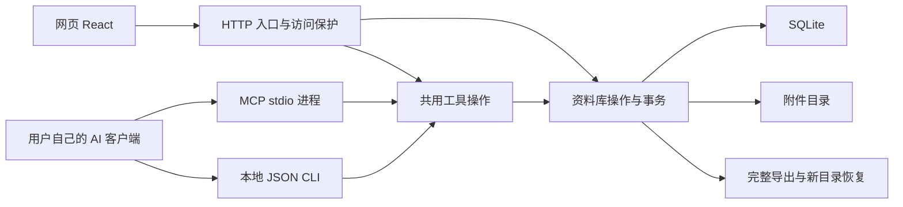

# 独立运行架构

LingBranch 一人一库。网页与本地 AI 进程共用 SQLite 和附件目录；产品行为见 [规格](../spec/local-first-library.md)。

## 实际入口与选择依据

| 边界 | 实现 | 依据 |
| --- | --- | --- |
| 网页 | [atlas.tsx](../web/app/atlas.tsx)、[globals.css](../web/app/globals.css) | 从固定原型复用画布与交互；Vite 输出静态资源，不保留 Sites/Next 部署层 |
| HTTP | [http.mjs](../server/http.mjs) | Node.js 原生 HTTP，同时提供网页和资料库入口 |
| 数据库 | [library.mjs](../server/library.mjs) | 内置 `node:sqlite`，避免另装数据库服务或原生驱动 |
| 共用规则 | [validation.mjs](../server/validation.mjs)、[tools.mjs](../server/tools.mjs) | HTTP、MCP 与 CLI 共用校验、事务及业务操作 |
| MCP | [mcp.mjs](../server/mcp.mjs) | 官方 SDK stdio 传输；stdout 仅协议消息，诊断走 stderr |
| CLI | [lingbranch.mjs](../cli/lingbranch.mjs) | 本地 JSON 工具入口，工具 schema 发现与完整分页；复用同一分发层 |
| 技能 | [SKILL.md](../skills/lingbranch/SKILL.md)、[安装器](../scripts/install-skill.mjs) | 4 个普通文件，助手通过显式路径启动 CLI，安装拒绝覆盖已有目标 |
| 资料包 | [bundle.mjs](../server/bundle.mjs) | 带整体与原件摘要的版本化 JSON gzip；先校验再写入新目录 |

`node:sqlite` 在已验证 Node.js 22.22.3 中仍属实验性 API。当前是一人使用的同步数据库操作，不提供大库性能承诺；检索与全量画布没有建立全文索引或分页画布渲染。后续规模问题需实际测量，不提前加入数据库抽象框架。[Node.js SQLite 文档](https://nodejs.org/download/release/v22.22.3/docs/api/sqlite.html)

## 数据与一致性

- `ideas` 保存正文、来源、标签、位置、归档和单调递增版本时间；`attachments` 保存不可变原件元数据；`connections` 用无序记录对唯一约束查重；`canvas` 保存视野；`receipts` 保存请求摘要与原始结果。
- SQLite 开启 WAL、外键、FULL 同步和 5 秒锁等待。写入使用 `BEGIN IMMEDIATE`，网页、MCP 和 CLI 不能同时领取同一空位或覆盖旧版本。全量读取与导出元数据使用一致的只读事务。
- 重试先检查凭据，同键不同参数拒绝。新请求修改时先比较 `expectedUpdatedAt`，再判断无变化；不把过期同值草稿报成成功。附件独立于正文版本。
- 新卡片复用原型 324 × 420 安放间距，涵盖 300px 卡片、图片和三个预览标签；不自动重排旧位置，用户主动拖动允许自定位置。真实 DOM 边界另做浏览器验证。
- 分页使用创建序号和首次读取上界；期间新增留到下次遍历。遍历中修改筛选字段时仍按当前筛选判定，不是跨请求的历史快照。
- 原件以 SHA-256 命名，先写临时文件、同步、原子改名，再提交元数据与凭据。中断可能留下无引用原件；没有自动清理程序，不把孤立文件当作上传成功。下载和导出重新校验字节数与摘要。
- 浏览器仅持有草稿、临时筛选位置和显示缓存，不用 localStorage 保存另一份资料库。视野写入串行处理并反馈失败。

## 访问边界

本机仅监听回环地址，检查 Host、Origin、跨站标记及写入头。服务器必须配置令牌与站点地址，所有资料库 API、附件与导出均要求认证；静态网页和登录状态不含资料库内容。不接收客户端提供的 owner 或 library 身份。

登录会话签名有效 12 小时，HttpOnly、SameSite=Strict，HTTPS 下附 Secure；令牌轮换使旧签名失效。TLS 由部署者的代理终止并转发原 Host，应用不信任转发的用户身份。配置见 [运行说明](running.md)。

MCP 与 CLI 权限来自运行进程的操作系统用户，只应在用户控制的客户端中启动；不通过网络用户身份选择另一份资料库。CLI 参数、JSON 文件和 stdin 校验后才打开数据库。协议参考 [官方 MCP 文档](https://modelcontextprotocol.io/docs/develop/build-server)，具体工具见 [接口说明](interfaces.md)。

## 图文正文的共享语义与保存

SQLite 资料库版本 2 为记录增加 `body_format`，旧库迁移补 `plain`，不改写原正文、标识、关系或位置。`bodyFormat` 入参可选且没有校验默认值，旧请求的标准化输入与凭据摘要保持原口径。

`shared/markdown.mjs` 使用 CommonMark AST 解析真实图片及引用定义，提供相邻文字摘要、字面格式转换与安全链接规则；服务端在共用 Library 中进一步核对原件存在、归属及安全预览格式。阅读与编辑从同一正文派生。编辑器移除 Builder 默认 GFM preset 及未支持控件，避免裸 URL 自动链接吞入旧文字的硬换行反斜杠；不增加另一份原文字段。代码示例不参与图片替换，外部图片在编辑器中同样不能自动加载。

末尾换行不是 CommonMark 段落末尾的有效孤硬换行，因此不能只去除 `trimEnd`。共用 `exactTextHandler` 对换行、制表和边界空白作标准数字字符引用编码，纯文本转换与编辑器的正式 remark 文本 handler 共用；移除自动软换行转换，避免吞行尾空格。编辑器硬换行也转到同一文本编码。既有字面字符引用和反斜杠正常转义，未增数据字段或另一份原文。初始规范序列仅为编辑器派生比较值，内容未变时返回已传入的正式正文，避免零操作保存改写格式。

编辑器通过 CrepeBuilder 及必要功能子路径组装，并在打开图文编辑时加载；使用相应功能样式，不启用代码高亮、公式或 AI 功能。图片使用正式 schema 配置保留有意义的 alt/title 说明，不用说明字段存缩放数值；插入后进入图片后的文字段落。编辑器将稳定引用映射到受保护的本库附件入口，草稿图片只在当前实例中使用临时地址。关闭后销毁该实例、释放其临时地址；过期回调不能改另一条记录。

当前图片大小修改不持久化，因此不提供编辑器 resize 操作；原图查看与下载继续保留。编辑器正文在实际 textbox 上提供中文可访问名称，卡片日期使用记录更新时间。

`shared/save-inspiration.mjs` 只协调当前草稿的冻结快照和阶段请求。新记录先取标识，原件上传后才提交完整正文；已有记录无需空正文阶段。新建、每个上传及最终更新保留各自完整请求和稳定键，读回失败也保留已成功阶段。最终正文与元数据在 Library 的一次事务更新中完成；冲突只能在用户核对后显式确认版本，不自动续用新版本。

图片统计包含所有图片原件，安全预览另作判定。文件区列非图片，无法预览及未引用图片保留下载入口。正文展示引用与完整原件存储分别维护，无自动删除或孤立原件清理。

## 备份与验证

完整资料包包含元数据、正文格式、附件字节、重试凭据和布局。新导出版本为 2、格式字段必填；版本 1 按旧结构严格校验再补纯文本格式。仅图文校验真实图片引用，纯文本图片语法不重新解释。恢复先校验结构、关系、原件及凭据引用，再在同级临时目录建库并检查完整性后交付；拒绝已存在的目录，错误包不能修改当前库。资料包上限 128 MiB，读取与压缩在内存进行。

验证使用自编内容和隔离目录，不连接私有网站。构建、测试、网页验收及外部部署的证据分别见 [验证记录](verification.md)。
