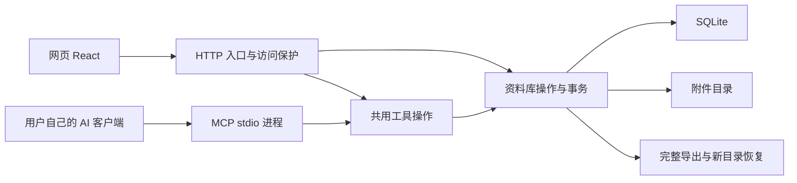

# 独立运行架构

LingBranch 一人一库。网页与本地 AI 进程共用 SQLite 和附件目录；产品行为见 [规格](../spec/local-first-library.md)。

## 实际入口与选择依据

| 边界 | 实现 | 依据 |
| --- | --- | --- |
| 网页 | [atlas.tsx](../web/app/atlas.tsx)、[globals.css](../web/app/globals.css) | 从固定原型复用画布与交互；Vite 输出静态资源，不保留 Sites/Next 部署层 |
| HTTP | [http.mjs](../server/http.mjs) | Node.js 原生 HTTP，同时提供网页和资料库入口 |
| 数据库 | [library.mjs](../server/library.mjs) | 内置 `node:sqlite`，避免另装数据库服务或原生驱动 |
| 共用规则 | [validation.mjs](../server/validation.mjs)、[tools.mjs](../server/tools.mjs) | HTTP 与 MCP 共用校验、事务及业务操作 |
| MCP | [mcp.mjs](../server/mcp.mjs) | 官方 SDK stdio 传输；stdout 仅协议消息，诊断走 stderr |
| 资料包 | [bundle.mjs](../server/bundle.mjs) | 带整体与原件摘要的版本化 JSON gzip；先校验再写入新目录 |

`node:sqlite` 在已验证 Node.js 22.22.3 中仍属实验性 API。当前是一人使用的同步数据库操作，不提供大库性能承诺；检索与全量画布没有建立全文索引或分页画布渲染。后续规模问题需实际测量，不提前加入数据库抽象框架。[Node.js SQLite 文档](https://nodejs.org/download/release/v22.22.3/docs/api/sqlite.html)

## 数据与一致性

- `ideas` 保存正文、来源、标签、位置、归档和单调递增版本时间；`attachments` 保存不可变原件元数据；`connections` 用无序记录对唯一约束查重；`canvas` 保存视野；`receipts` 保存请求摘要与原始结果。
- SQLite 开启 WAL、外键、FULL 同步和 5 秒锁等待。写入使用 `BEGIN IMMEDIATE`，网页和 MCP 不能同时领取同一空位或覆盖旧版本。全量读取与导出元数据使用一致的只读事务。
- 重试先检查凭据，同键不同参数拒绝。新请求修改时先比较 `expectedUpdatedAt`，再判断无变化；不把过期同值草稿报成成功。附件独立于正文版本。
- 新卡片复用原型 324 × 420 安放间距，涵盖 300px 卡片、图片和三个预览标签；不自动重排旧位置，用户主动拖动允许自定位置。真实 DOM 边界另做浏览器验证。
- 分页使用创建序号和首次读取上界；期间新增留到下次遍历。遍历中修改筛选字段时仍按当前筛选判定，不是跨请求的历史快照。
- 原件以 SHA-256 命名，先写临时文件、同步、原子改名，再提交元数据与凭据。中断可能留下无引用原件；没有自动清理程序，不把孤立文件当作上传成功。下载和导出重新校验字节数与摘要。
- 浏览器仅持有草稿、临时筛选位置和显示缓存，不用 localStorage 保存另一份资料库。视野写入串行处理并反馈失败。

## 访问边界

本机仅监听回环地址，检查 Host、Origin、跨站标记及写入头。服务器必须配置令牌与站点地址，所有资料库 API、附件与导出均要求认证；静态网页和登录状态不含资料库内容。不接收客户端提供的 owner 或 library 身份。

登录会话签名有效 12 小时，HttpOnly、SameSite=Strict，HTTPS 下附 Secure；令牌轮换使旧签名失效。TLS 由部署者的代理终止并转发原 Host，应用不信任转发的用户身份。配置见 [运行说明](running.md)。

MCP 权限来自运行进程的操作系统用户，只应在用户控制的客户端中启动。协议参考 [官方 MCP 文档](https://modelcontextprotocol.io/docs/develop/build-server)，具体工具见 [接口说明](interfaces.md)。

## 备份与验证

完整资料包包含元数据、附件字节、重试凭据和布局。恢复拒绝已存在的目录，在同级临时目录建库并检查完整性后交付；错误包不能修改当前库。资料包上限 128 MiB，读取与压缩在内存进行。

验证使用自编内容和隔离目录，不连接私有网站。构建、测试、网页验收及外部部署的证据分别见 [验证记录](verification.md)。
